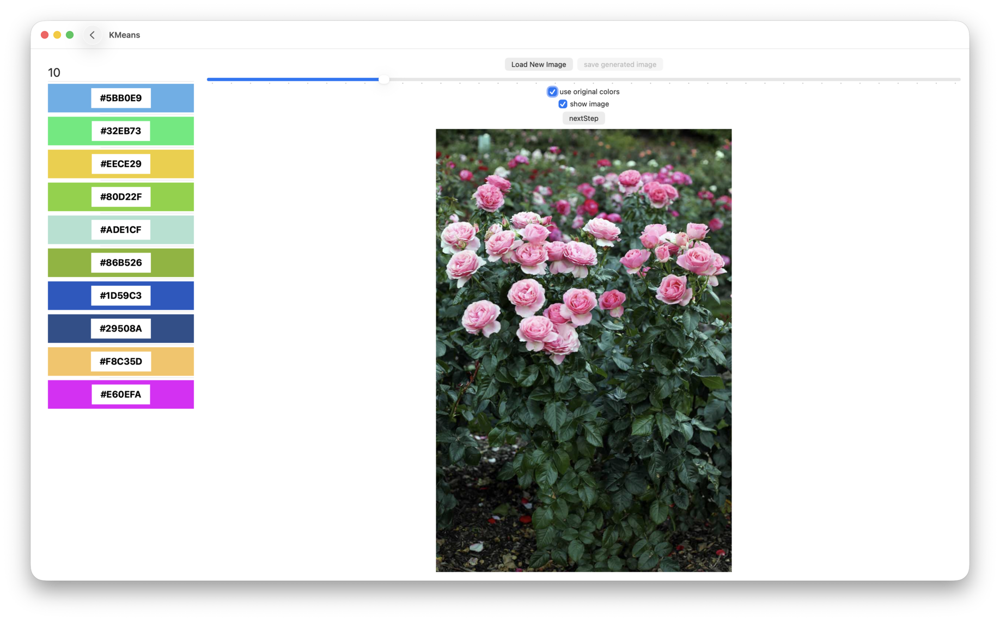
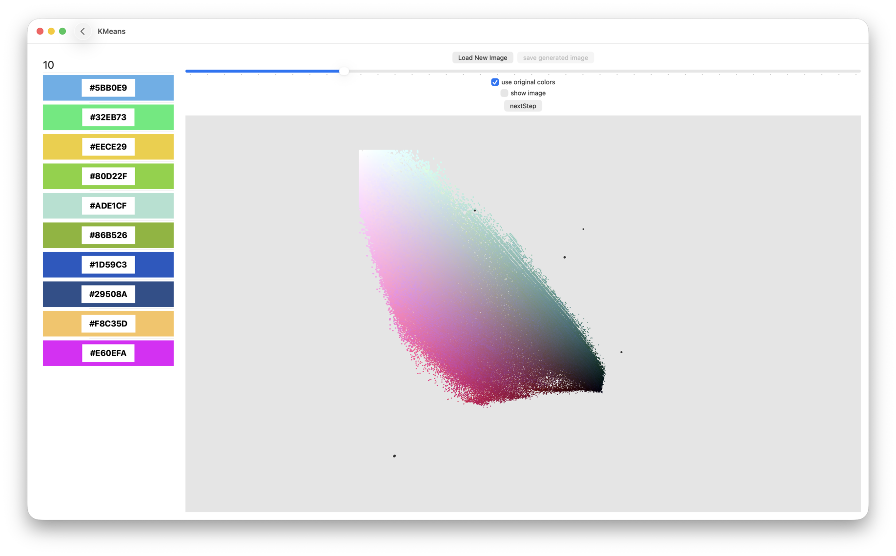
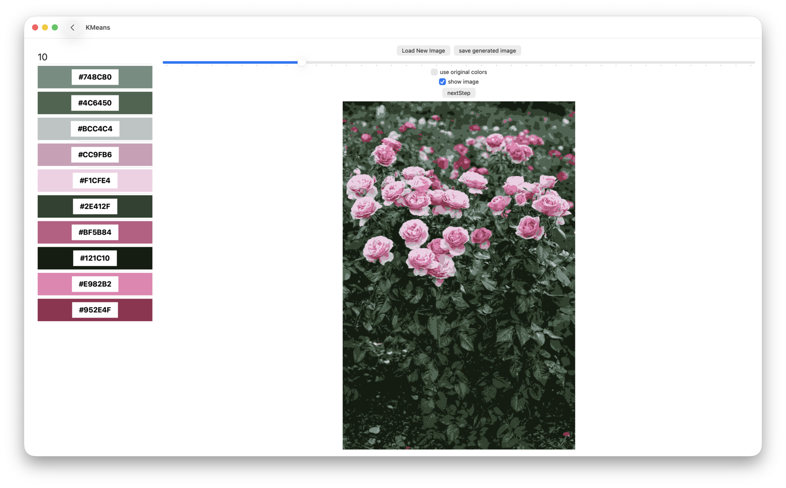
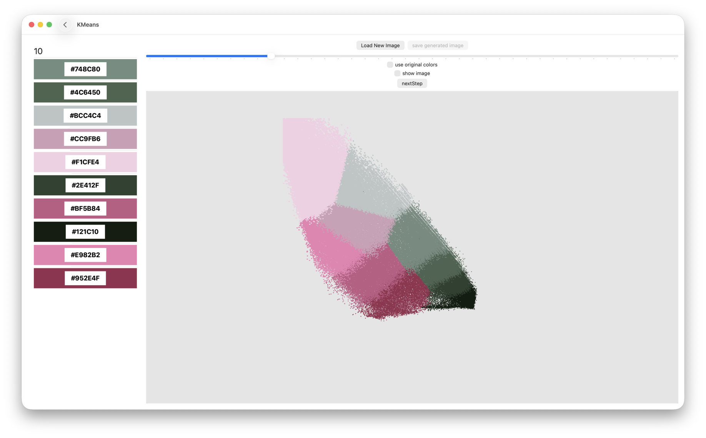

# KMeans

SwiftUI app for visualising K-Means clusterisation, rendered using metal.

It supports loading an image, converting all it's RGB colors into points in 3D space
and performing K-means clusterisation on the points.a

The clusterisation can be displayed in a 3D scene, or it can be applied to the original
image, creating a new one. The new image can be saved.

### Screenshots:
initial image:

initial scene:

clustered image:

clustered scene:

